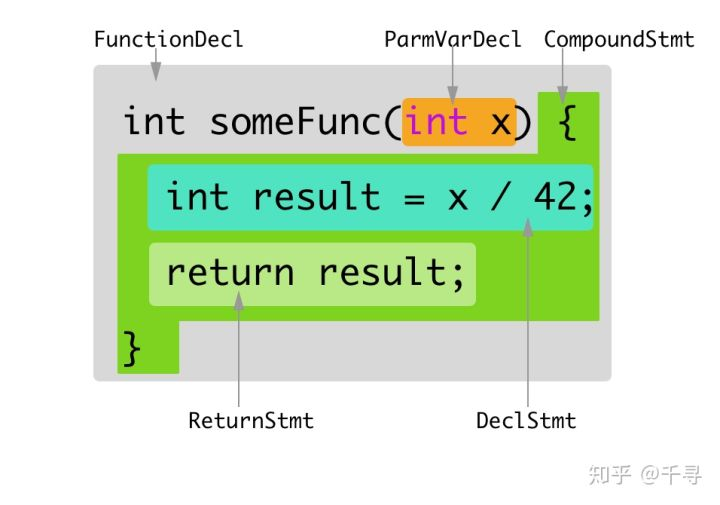
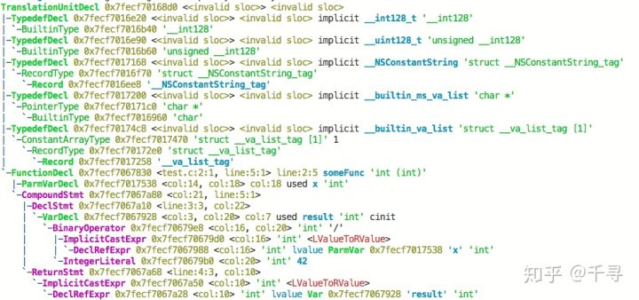

## clang ast


`ast`全称叫做`abstract syntax tree`，即抽象语法树。`clang`可以把源代码解析成抽象语法树的形式，并通过相关工具可以进行导出。考虑下面的代码：

```cpp
int f(int x) {
  int result = (x / 42);
  return result;
}
```

经过手工分析，我们可以将上述代码解析为如下的形式：  


我们可以用`clang -Xclang -ast-dump -fsyntax-only test.hxx`这个指令打印出这段代码的`ast`输出：

```shell
TranslationUnitDecl 0x5aea0d0 <<invalid sloc>>
... cutting out internal declarations of clang ...
`-FunctionDecl 0x5aeab50 <test.cc:1:1, line:4:1> f 'int (int)'
  |-ParmVarDecl 0x5aeaa90 <line:1:7, col:11> x 'int'
  `-CompoundStmt 0x5aead88 <col:14, line:4:1>
    |-DeclStmt 0x5aead10 <line:2:3, col:24>
    | `-VarDecl 0x5aeac10 <col:3, col:23> result 'int'
    |   `-ParenExpr 0x5aeacf0 <col:16, col:23> 'int'
    |     `-BinaryOperator 0x5aeacc8 <col:17, col:21> 'int' '/'
    |       |-ImplicitCastExpr 0x5aeacb0 <col:17> 'int' <LValueToRValue>
    |       | `-DeclRefExpr 0x5aeac68 <col:17> 'int' lvalue ParmVar 0x5aeaa90 'x' 'int'
    |       `-IntegerLiteral 0x5aeac90 <col:21> 'int' 42
    `-ReturnStmt 0x5aead68 <line:3:3, col:10>
      `-ImplicitCastExpr 0x5aead50 <col:10> 'int' <LValueToRValue>
        `-DeclRefExpr 0x5aead28 <col:10> 'int' lvalue Var 0x5aeac10 'result' 'int'
```




所有输出都展开的话应该有几十万行，这里面有非常多我们不需要关心的部分。幸亏`clang`提供了`ast matcher`相关组件，我们可以使用`ast matcher`来过滤`ast dump`的输出，来获取我们所感兴趣的部分。下面就是一个只打印参数类型有`std::vector`的所有函数声明：

```cpp
DeclarationMatcher Matcher = functionDecl(
hasAnyParameter(hasType(recordDecl(matchesName("std::vector"))));

class VecCallback : public clang::ast_matchers::MatchFinder::MatchCallback {
public:
virtual void
run(const clang::ast_matchers::MatchFinder::MatchResult &Result) final {
    llvm::outs() << ".";
    if (const auto *F =
    Result.Nodes.getDeclAs<clang::FunctionDecl>(FunctionID)) {
            const auto& SM = *Result.SourceManager;
            const auto& Loc = F->getLocation();
            llvm::outs() << SM.getFilename(Loc) << ":"
            << SM.getSpellingLineNumber(Loc) << ":"
            << SM.getSpellingColumnNumber(Loc) << "\n";
        }
    }
};
```

对于我们的反射需求来说，我们需要获得如下信息：

1. 所有需要反射的类声明
2. 每个需要反射的类里面的成员变量声明
3. 每个需要反射的类里面的成员函数声明
4. 每个反射类的继承链
5. 特定的全局函数

这些信息我们都可以通过`ast matcher`来获得，获取这些信息之后，我们可以`dump`出每个类的信息。

对于`namespace A`下面的这个类：

```cpp
struct s_1
{

    optional<int> a = 0;
    pair<int, optional<float>> b;
    tuple<int, float, string> c;
};
```

我们dump出来的结果是这样的:

```json
{
            "bases": null,
            "constructors": null,
            "fields": {
                "A::s_1::a": {
                    "name": "A::s_1::a",
                    "node_type": "variable",
                    "qualified_name": "A::s_1::a",
                    "var_type": "std::optional<int>",
                    "with_default": true
                },
                "A::s_1::b": {
                    "name": "A::s_1::b",
                    "node_type": "variable",
                    "qualified_name": "A::s_1::b",
                    "var_type": "std::pair<int,std::optional<float>>",
                    "with_default": false
                },
                "A::s_1::c": {
                    "name": "A::s_1::c",
                    "node_type": "variable",
                    "qualified_name": "A::s_1::c",
                    "var_type": "std::tuple<int,float,std::basic_string<char,std::char_traits<char>,std::allocator<char>>>",
                    "with_default": false
                }
            },
            "methods": null,
            "name": "A::s_1",
            "node_type": "class",
            "qualified_name": "A::s_1",
            "static_fields": null,
            "static_methods": null,
            "template_args": []
        }
```

## c++ attribute

属性(`Attribute`)是构成程序基本结构的元数据,开发者可以通过属性来给编译器传递必要的语义信息.例如,属性可以改变程序的代码生成结构,或者提供额外的静态分析的语义信息。下面就是一个标准的给声明加属性的代码片段：

```cpp
[[gnu::always_inline]] [[gnu::hot]] [[gnu::const]] [[nodiscard]]
inline int f(); // declare f with four attributes

[[gnu::always_inline, gnu::const, gnu::hot, nodiscard]]
int f(); // same as above, but uses a single attr specifier that contains four attributes

// C++17:
[[using gnu : const, always_inline, hot]] [[nodiscard]]
int f[[gnu::always_inline]](); // an attribute may appear in multiple specifiers

int f() { return 0; }
```

属性的语法跟平常的代码不怎么相同，推荐看一下这个链接[https://en.cppreference.com/w/cpp/language/attributes](https://link.zhihu.com/?target=https%3A//en.cppreference.com/w/cpp/language/attributes)。

上面的是`c++`标准里关于属性的语法，其实在`gcc`和`msvc`里面早就有了对应语义的属性定义，但是语法方式采取的不相同。

下面的是`gnu`的属性定义方式：

```cpp
extern void exit(int)  __attribute__((noreturn));
extern void abort(void)  __attribute__((noreturn));

- (CGSize)sizeWithFont:(UIFont *)font NS_DEPRECATED_IOS(2_0, 7_0, "Use -sizeWithAttributes:") __TVOS_PROHIBITED;

//来看一下 后边的宏
 #define NS_DEPRECATED_IOS(_iosIntro, _iosDep, ...) CF_DEPRECATED_IOS(_iosIntro, _iosDep, __VA_ARGS__)

define CF_DEPRECATED_IOS(_iosIntro, _iosDep, ...) __attribute__((availability(ios,introduced=_iosIntro,deprecated=_iosDep,message="" __VA_ARGS__)))

//宏展开以后如下
__attribute__((availability(ios,introduced=2_0,deprecated=7_0,message=""__VA_ARGS__)));
//ios即是iOS平台
//introduced 从哪个版本开始使用
//deprecated 从哪个版本开始弃用
//message    警告的消息
```

下面的是`msvc`的属性定义方式：

```cpp
_declspec(dllimport) class X {} varX;
__declspec(align(32)) struct Str1{
   int a, b, c, d, e;
};
#define MY_TEXT "function is deprecated"
void func1(void) {}
__declspec(deprecated) void func1(int) {}
__declspec(deprecated("** this is a deprecated function **")) void func2(int) {}
__declspec(deprecated(MY_TEXT)) void func3(int) {}

class X {
   __declspec(noinline) int mbrfunc() {
      return 0;
   }   // will not inline
};
```

这些属性都是编译器预先定义好了的，来实现标准之外的特定扩展功能的。但是有一个属性是例外的，他就是`annotate`属性，这个属性不带任何语义信息，只是为了标注用。我们可以这么利用`annotate`属性：

```cpp
#define CLASS() class __attribute__((annotate("reflect-class")))
#define PROPERTY() __attribute__((annotate("reflect-property")))
CLASS() User
{
    public:
    PROPERTY()
    uint64_t id;
    PROPERTY()
    string name;
    PROPERTY()
    vector<string> pets;
};
```

这个`annotate`属性可以被`clang ast dump`出来，作为`AnnotateAttr`来存在：

```shell
CXXRecordDecl 0x7fcda1bae7e0 <./metareflect.hxx:19:24, test.hxx:130:1> line:115:9 class User definition
|-AnnotateAttr 0x7fcda1bae908 <./metareflect.hxx:19:45, col:83> "reflect-class;"
|-CXXRecordDecl 0x7fcda1bae960 <col:24, test.hxx:115:9> col:9 implicit class User
|-FieldDecl 0x7fcda1baea80 <./metareflect.hxx:21:27, test.hxx:121:14> col:14 id 'uint64_t':'unsigned long long'
|-`-AnnotateAttr 0x7fcda1baeac8 <./metareflect.hxx:21:42, col:83> "reflect-property"
|-FieldDecl 0x7fcda1baebb0 <./metareflect.hxx:21:27, test.hxx:125:12> col:12 name 'string':'std::__1::basic_string<char>'
|-`-AnnotateAttr 0x7fcda1baebf8 <./metareflect.hxx:21:42, col:83> "reflect-property"
|-FieldDecl 0x7fcda227a228 <./metareflect.hxx:21:27, test.hxx:129:20> col:20 pets
|-'vector<string>':'std::__1::vector<std::__1::basic_string<char>, std::__1::allocator<std::__1::basic_string<char> > >'
|-`-AnnotateAttr 0x7fcda227a270 <./metareflect.hxx:21:42, col:83> "reflect-property"
```

好了， 现在我们有了任意声明的`Annotate`属性，但是他的值只是一个字符串。一个简单的字符串是无法承担丰富的语义的，我们需要某种将元数据转变为字符串的功能。作为启发，我们来回顾一下`Unreal`里的代码：

```cpp
UCLASS(BlueprintType)
class HELLO_API UMyClass : public UObject
{
    GENERATED_BODY()
public:
    UPROPERTY(BlueprintReadWrite)
    float Score;
public:
    UFUNCTION(BlueprintCallable, Category = "Hello")
    void CallableFunc();    //C++实现，蓝图调用
    UFUNCTION(BlueprintNativeEvent, Category = "Hello")
    void NativeFunc();  //C++实现默认版本，蓝图可重载实现
    UFUNCTION(BlueprintImplementableEvent, Category = "Hello")
    void ImplementableFunc();   //C++不实现，蓝图实现
};
```