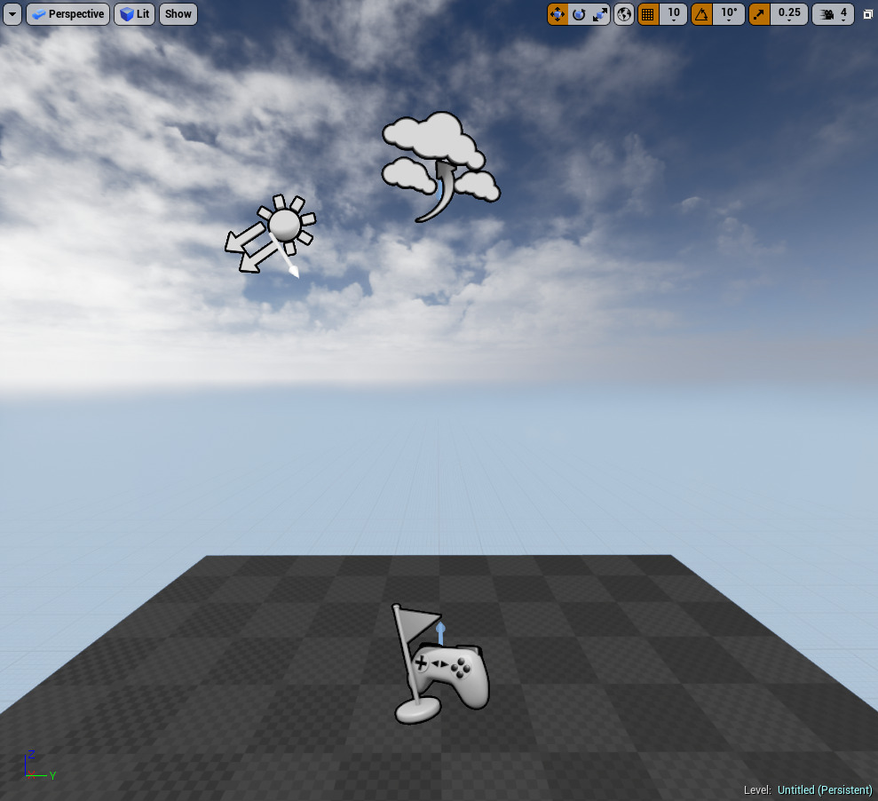

# Unreal Projects and Gameplay

## Introduction to projects, levels, classes, and Actors in Unreal Engine.

[Unreal Engine 4.9](https://docs.unrealengine.com/en-US/SiteIndex/index.html?versions=4_9)

Everything for your project is contained within the project directory. You can create as many projects as you would like, but each one is self-contained. Using Unreal Engine's **Project Browser** to [create new projects](https://docs.unrealengine.com/en-US/Engine/Basics/Projects/Browser/index.html) will set up the necessary project framework such as the [directory structure](https://docs.unrealengine.com/en-US/Engine/Basics/DirectoryStructure/index.html) and the Unreal Project File (`[ProjectName].uproject`) that you can [open in Unreal Editor](https://docs.unrealengine.com/en-US/Engine/Basics/Projects/Browser/index.html) .
项目的所有内容都包含在项目目录中。 您可以创建任意多个项目，但是每个项目都是独立的。 使用虚幻引擎的“项目浏览器” [创建新项目](https://docs.unrealengine.com/en-US/Engine/Basics/Projects/Browser/index.html) 将建立必要的项目框架，例如 作为[目录结构](https://docs.unrealengine.com/zh-CN/Engine/Basics/DirectoryStructure/index.html) 和您可以[在虚幻编辑器中打开](https://docs.unrealengine.com/zh-CN/Engine/Basics/Projects/Browser/index.html)的虚幻项目文件（`[ProjectName] .uproject`） 。

Your project contains assets, stored as `.uasset` files in the Content folder. These assets can include Materials, Static and Skeletal Meshes, Blueprints, Sound Cues, and Textures, and are reusable reference materials and templates that can be called upon by objects in your project.
您的项目中包含资产，这些资产存储为Content文件夹中的.uasset文件。 这些资产可以包括“材质”，“静态和骨架网格物体”，“蓝图”，“声音提示”和“纹理”，并且是可重复使用的参考材料和模板，可以由项目中的对象调用。

Projects also contain levels. Levels are also often referred to as maps, and are stored as `.umap` files within the Content folder. Within Unreal Editor, you work on one level at a time, and the level is displayed in the **Viewport**.
项目还包含级别。 级别通常也称为地图，并存储为Content文件夹中的.umap文件。 在虚幻编辑器中，您一次只能处理一个级别，并且该级别显示在“视口”中。

At the most fundamental level, an **Actor** is a gameplay entity that (usually) contains one or more components, can be placed in a **Level** or **Spawned** in during gameplay, and support network replication for multiplayer games. In the above level, the ground platform, the blocks in the center of the level, and the PlayerStart visible at the bottom of the image are all Actors. All Actors extend from the AActor class, which is the base class of spawnable gameplay Objects.

Actors can be thought of, in one sense, as containers that hold special types of **Objects** called **Components**. For instance, a CameraActor contains a CameraComponent.

The functionality of a camera, like the field of view, is all contained within the CameraComponent. That means that the CameraComponent can be included in other Actors, like a Character, to give the same camera functionality to those Objects.

Different types of components can be used to control how Actors move, how they are rendered, and many other parts of their functionality. All Objects, including Components, extend from the UObject class, which is the base class of all gameplay Objects. This means they cannot be directly instanced into the world; they must belong to an Actor.

Each Actor or Object is a single instance of a class. The class sets up the template for the Actor or Object. It defines the variables that can be set for that Actor or Object, and the functions that can be carried out within that Actor or Object. You can create new classes, or types of Objects and Actors, with C++ code. Blueprint Classes primarily allow you to create classes that set up new Actors, although you can extend a few Objects with Blueprint Classes as well. You can also combine the two, by creating a new C++ class and then making a Blueprint Class derived from that C++ class. To learn more about creating classes so you can make new kinds of Actors and Objects, see the [Class Creation Basics](https://docs.unrealengine.com/en-US/Gameplay/ClassCreation/index.html) page.