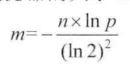
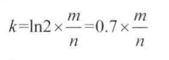

# [说一说布隆过滤器](https://segmentfault.com/a/1190000015482091)

[ java](https://segmentfault.com/t/java)

发布于 2018-07-04


## 介绍

布隆过滤器在wiki上的介绍:

> 布隆过滤器（Bloom Filter）是1970年由布隆提出的。它实际上是一个很长的二进制向量和一系列随机映射函数。布隆过滤器可以用于检索一个元素是否在一个集合中。它的优点是空间效率和查询时间都远远超过一般的算法，缺点是有一定的误识别率和删除困难

## 为什么要用布隆过滤器？

事实上，布隆过滤器被广泛用于网页黑名单系统、垃圾邮件过滤系统、爬虫的网址判重系统以及解决缓存穿透问题。通过介绍已经知晓布隆过滤器的作用是检索一个元素是否在集合中。可能有人认为这个功能非常简单，直接放在redis中或者数据库中查询就好了。又或者当数据量较小，内存又足够大时，使用hashMap或者hashSet等结构就好了。但是如果当这些数据量很大，数十亿甚至更多，内存装不下且数据库检索又极慢的情况，我们应该如何去处理？这个时候我们不妨考虑下布隆过滤器，因为它是一个空间效率占用极少和查询时间极快的算法，但是需要业务可以忍受一个判断失误率。

## 哈希函数

布隆过滤器离不开哈希函数，所以在这里有必要介绍下哈希函数的概念，如果你已经掌握了，可以直接跳到下一小节。
哈希函数的性质:

1. 经典的哈希函数都有无限大的输入值域(无穷大)。
2. 经典的哈希函数的输出域都是固定的范围(有穷大，假设输出域为S)
3. 当给哈希函数传入相同的值时，返回值必一样
4. 当给哈希函数传入不同的输入值时，返回值可能一样，也可能不一样。
5. 输入值会尽可能均匀的分布在S上

前三点都是哈希函数的基础，第四点描述了哈希函数存在哈希碰撞的现象，因为输入域无限大，输出域有穷大，这是必然的，输入域中会有不同的值对应到输入域S中。第五点事评价一个哈希函数优劣的关键，哈希函数越优秀，分布就越均匀且与输入值出现的规律无关。比如存在"hash1","hash2","hash3"三个输入值比较类似，经过哈希函数计算后的结果应该相差非常大，可以通过常见的MD5和SHA1算法来验证这些特性。如果一个优秀的函数能够做到不同的输入值所得到的返回值可以均匀的分布在S中，将其返回值对m取余(%m),得到的返回值可以认为也会均匀的分布在0~m-1位置上。

## 基于缓存业务分析布隆过滤器原理

在大多应用中，当业务系统中发送一个请求时，会先从缓存中查询；若缓存中存在，则直接返回；若返回中不存在，则查询数据库。其流程如下图所示:


缓存穿透：当请求数据库中不存在的数据，这时候所有的请求都会打到数据库上，这种情况就是缓存穿透。如果当请求较多的话，这将会严重浪费数据库资源甚至导致数据库假死。

------

接下来开始介绍布隆过滤器。有一个长度为m的bit型数组，如我们所知，每个位置只占一个bit，每个位置只有0和1两种状态。假设一共有k个哈希函数相互独立，输入域都为s且都大于等于m，那么对同一个输入对象（可以想象为缓存中的一个key），经过k个哈希函数计算出来的结果也都是独立的。对算出来的每一个结果都对m取余，然后在bit数组上把相应的位置设置为1(描黑)，如下图所示：


至此一个输入对象对bit array集合的影响过程就结束了，我们可以看到会有多个位置被描黑，也就是设置为1.接下来所有的输入对象都按照这种方式去描黑数组，最终一个布隆过滤器就生成了，它代表了所有输入对象组成的集合。
那么如何判断一个对象是否在过滤器中呢？假设一个输入对象为hash1,我们需要通过看k个哈希函数算出k个值，然后把k个值取余（%m），就得到了k个[0,m-1]的值。然后我们判断bit array上这k个值是否都为黑，如果有一个不为黑，那么肯定hash1肯定不在这个集合里。如果都为黑，则说明hash1在集合里，但有可能误判。因为当输入对象过多，而集合过小，会导致集合中大多位置都会被描黑，那么在检查hash1时，有可能hash1对应的k个位置正好被描黑了，然后错误的认为hash1存在集合里。

## 控制布隆过滤器的误判率

如果bit array集合的大小m相比于输入对象的个数过小，失误率就会变高。这里直接引入一个已经得到证明的公式，根据输入对象数量n和我们想要达到的误判率为p计算出布隆过滤器的大小m和哈希函数的个数k.
布隆过滤器的大小m公式:



哈希函数的个数k公式:



布隆过滤器真实失误率p公式：


假设我们的缓存系统，key为userId，value为user。如果我们有10亿个用户，规定失误率不能超过0.01%，通过计算器计算可得m=19.17n，向上取整为20n，也就是需要200亿个bit，换算之后所需内存大小就是2.3G。通过第二个公式可计算出所需哈希函数k=14.因为在计算m的时候用了向上取整，所以真是的误判率绝对小于等于0.01%。

## 快速集成BloomFilter

关于布隆过滤器，我们不需要自己实现，谷歌已经帮我们实现好了。

- pom引入依赖

```
<!-- https://mvnrepository.com/artifact/com.google.guava/guava -->
<dependency>
    <groupId>com.google.guava</groupId>
    <artifactId>guava</artifactId>
    <version>25.1-jre</version>
</dependency>
```

- 核心api

```
/**
   * Creates a {@link BloomFilter BloomFilter<T>} with the expected number of
   * insertions and expected false positive probability.
   *
   * <p>Note that overflowing a {@code BloomFilter} with significantly more elements
   * than specified, will result in its saturation, and a sharp deterioration of its
   * false positive probability.
   *
   * <p>The constructed {@code BloomFilter<T>} will be serializable if the provided
   * {@code Funnel<T>} is.
   *
   * <p>It is recommended that the funnel be implemented as a Java enum. This has the
   * benefit of ensuring proper serialization and deserialization, which is important
   * since {@link #equals} also relies on object identity of funnels.
   *
   * @param funnel the funnel of T's that the constructed {@code BloomFilter<T>} will use
   * @param expectedInsertions the number of expected insertions to the constructed
   *     {@code BloomFilter<T>}; must be positive
   * @param fpp the desired false positive probability (must be positive and less than 1.0)
   * @return a {@code BloomFilter}
   */
  public static <T> BloomFilter<T> create(
      Funnel<T> funnel, int expectedInsertions /* n */, double fpp) {
    checkNotNull(funnel);
    checkArgument(expectedInsertions >= 0, "Expected insertions (%s) must be >= 0",
        expectedInsertions);
    checkArgument(fpp > 0.0, "False positive probability (%s) must be > 0.0", fpp);
    checkArgument(fpp < 1.0, "False positive probability (%s) must be < 1.0", fpp);
    if (expectedInsertions == 0) {
      expectedInsertions = 1;
    }
    /*
     * TODO(user): Put a warning in the javadoc about tiny fpp values,
     * since the resulting size is proportional to -log(p), but there is not
     * much of a point after all, e.g. optimalM(1000, 0.0000000000000001) = 76680
     * which is less than 10kb. Who cares!
     */
    long numBits = optimalNumOfBits(expectedInsertions, fpp);
    int numHashFunctions = optimalNumOfHashFunctions(expectedInsertions, numBits);
    try {
      return new BloomFilter<T>(new BitArray(numBits), numHashFunctions, funnel,
          BloomFilterStrategies.MURMUR128_MITZ_32);
    } catch (IllegalArgumentException e) {
      throw new IllegalArgumentException("Could not create BloomFilter of " + numBits + " bits", e);
    }
  }
/**
   * Returns {@code true} if the element <i>might</i> have been put in this Bloom filter,
   * {@code false} if this is <i>definitely</i> not the case.
   */
  public boolean mightContain(T object) {
    return strategy.mightContain(object, funnel, numHashFunctions, bits);
  }
```

- 一个小例子

```
public static void main(String... args){
        /**
         * 创建一个插入对象为一亿，误报率为0.01%的布隆过滤器
         */
        BloomFilter<CharSequence> bloomFilter = BloomFilter.create(Funnels.stringFunnel(Charset.forName("utf-8")), 100000000, 0.0001);
        bloomFilter.put("121");
        bloomFilter.put("122");
        bloomFilter.put("123");
        System.out.println(bloomFilter.mightContain("121"));
    }
```


阅读 11.4k 更新于 2018-07-04