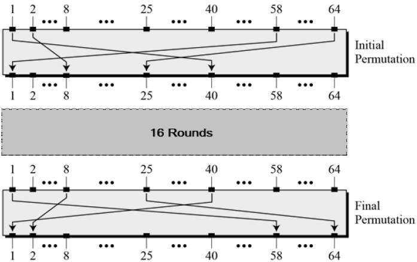
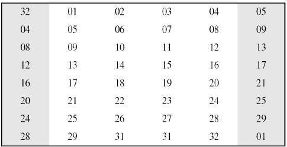
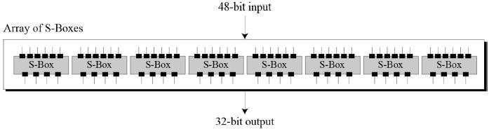
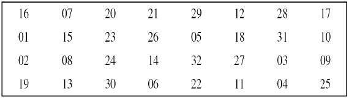
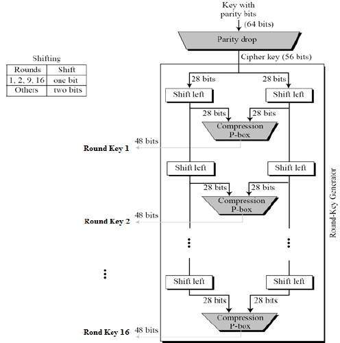

from https://www.tutorialspoint.com/cryptography/data_encryption_standard.htm

# Data Encryption Standard

------

Advertisements

[ Previous Page](https://www.tutorialspoint.com/cryptography/feistel_block_cipher.htm)

[Next Page ](https://www.tutorialspoint.com/cryptography/triple_des.htm)

The Data Encryption Standard (DES) is a symmetric-key block cipher published by the National Institute of Standards and Technology (NIST).
数据加密标准（DES）是美国国家标准技术研究院（NIST）发布的对称密钥分组密码。

DES is an implementation of a Feistel Cipher. It uses 16 round Feistel structure. The block size is 64-bit. Though, key length is 64-bit, DES has an effective key length of 56 bits, since 8 of the 64 bits of the key are not used by the encryption algorithm (function as check bits only). General Structure of DES is depicted in the following illustration −
DES是Feistel密码的实现。 它采用16轮Feistel结构。 块大小为64位。 尽管密钥长度为64位，但DES的有效密钥长度为56位，因为密钥的64位中的8位未被加密算法使用（仅用作校验位）。 DES的一般结构如下图所示-

Since DES is based on the Feistel Cipher, all that is required to specify DES is −
由于DES基于Feistel密码，因此指定DES所需要做的就是-

- Round function 圆形？？？功能
- Key schedule 关键时间表？？？ 
- Any additional processing − Initial and final permutation 任何其他（扩展）处理-初始和最终置换

## Initial and Final Permutation 初始和最终排列

The initial and final permutations are straight Permutation boxes (P-boxes) that are inverses of each other. They have no cryptography significance in DES. The initial and final permutations are shown as follows −
初始置换和最终置换是直的置换框（P框），它们彼此相反。 它们在DES中没有加密意义。 初始和最终排列如下所示-

## Round Function

The heart of this cipher is the DES function, *f*. The DES function applies a 48-bit key to the rightmost 32 bits to produce a 32-bit output.
该密码的核心是DES函数 *f* 。 DES函数将48位密钥应用于最右边的32位，以产生32位输出。

- **Expansion Permutation Box** − Since right input is 32-bit and round key is a 48-bit, we first need to expand right input to 48 bits. Permutation logic is graphically depicted in the following illustration −

- The graphically depicted permutation logic is generally described as table in DES specification illustrated as shown −

- **XOR (Whitener).** − After the expansion permutation, DES does XOR operation on the expanded right section and the round key. The round key is used only in this operation.
- **Substitution Boxes.** − The S-boxes carry out the real mixing (confusion). DES uses 8 S-boxes, each with a 6-bit input and a 4-bit output. Refer the following illustration −

- The S-box rule is illustrated below −

- There are a total of eight S-box tables. The output of all eight s-boxes is then combined in to 32 bit section.

- **Straight Permutation** − The 32 bit output of S-boxes is then subjected to the straight permutation with rule shown in the following illustration:

  

## Key Generation

The round-key generator creates sixteen 48-bit keys out of a 56-bit cipher key. The process of key generation is depicted in the following illustration −

The logic for Parity drop, shifting, and Compression P-box is given in the DES description.

## DES Analysis

The DES satisfies both the desired properties of block cipher. These two properties make cipher very strong.

- **Avalanche effect** − A small change in plaintext results in the very great change in the ciphertext.
- **Completeness** − Each bit of ciphertext depends on many bits of plaintext.

During the last few years, cryptanalysis have found some weaknesses in DES when key selected are weak keys. These keys shall be avoided.

DES has proved to be a very well designed block cipher. There have been no significant cryptanalytic attacks on DES other than exhaustive key search.