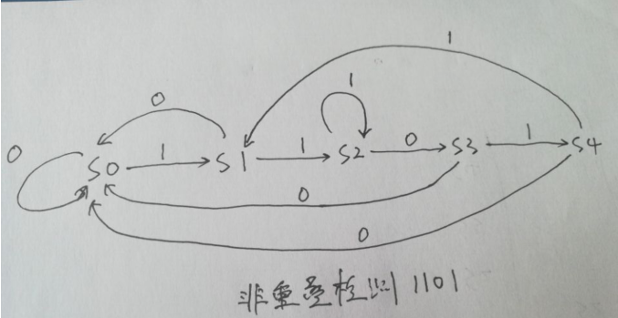
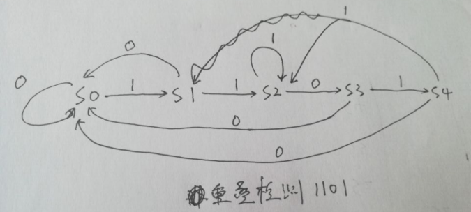
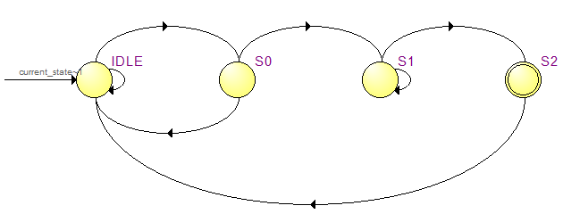
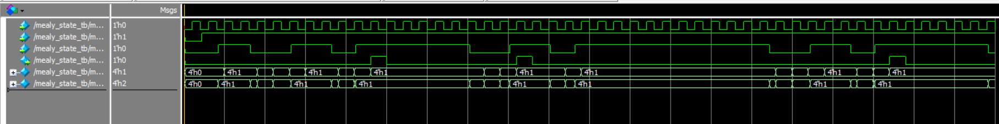
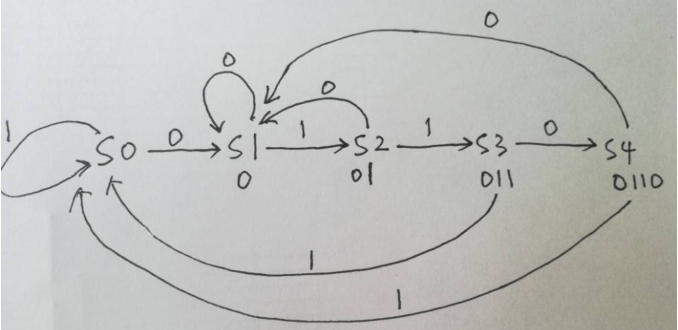

from https://www.firebbs.cn/forum.php?mod=viewthread&tid=29868&highlight=%E7%8A%B6%E6%80%81%E6%9C%BA

# [Moore型状态机和Mealy型状态机](https://www.cnblogs.com/571328401-/p/13193815.html)


　　一、状态机的定义

　　　　状态机就是能够根据控制信号按照预先设定的状态进行状态转移，是协调相关信号动作、完成特定动作的控制中心。状态机简写为 FSM （Finite  State  Machine）,分为两类：

　　　　1：输出只和当前状态有关而与输入无关，则称为摩尔（Moore）状态机；

　　　　2：输出不仅和当前状态有关而且和输入有关，则称为米利（Mealy）状态机；

 

　　二、两种状态机的区别

　　　　1：在波形上区别：以一个序列检测器为例，检测到输入信号11时输出z为1，其他时候为0。用摩尔型FSM实现需要用到三个状态（A，B，C）。而用米利型FSM实现则需要两个状态（A，B）。摩尔型FSM输出函数的输入只由状态变量决定，要想输出z=1，必须C状态形成，即寄存器中的两个1都打进去后才可以。输出z=1会在`下一个有效沿到来`的时候被赋值。而米利型FSM输出函数是由输入和状态变量共同决定的。状态在B的时候如果输入为1，则`直接以组合电路输出z=1`，不需要等到下个有效沿到来。从而也就不需要第三个状态C。

　　　　2：摩尔状态机更安全：输出在时钟边沿变化（总是在一个周期后）。在Mealy机器中，输入更改可能会在逻辑完成后立即导致输出更改, 当两台机器互连时出现大问题 ，如果不小心，可能会发生`异步反馈`。

　　　　3：Mealy状态机对输入的`反应更快：在相同的周期内反应 - 不需要等待时钟。``在Moore机器中，可能需要更多逻辑来将状态解码为输出 - 在时钟边沿之后更多的门延迟。`并非所有时序电路都可以使用Mealy模型实现。 一些时序电路只能作为摩尔机器实现。

 

　　三、经典三段式状态机模板

```
 1 reg        [:]            current_state           ;
 2 reg        [:]            next_state               ;    
 3 
 4 wire        [:0]            IDLE                    ;
 5 wire        [:0]            S0                ;
 6 wire        [:0]            S1                ;
 7 wire        [:0]            S2                ;
 8 
 9 //=============================================================================\
10 //****************************     State Machine    *******************************
11 //=============================================================================\
12     
13 always @(posedge sclk or negedge s_rst_n) begin
14     if(!s_rst_n)
15         current_state <= IDLE;
16     else
17         current_state <= next_state;
18 end
19 
20 always @(*) begin
21     next_state = IDLE;
22     case(current_state)
23         IDLE:begin
24             if(idle2s0 == 1'b1)
25                 next_state = S0;
26             else
27                 next_state = current_state;
28         end
29         
30         S0:begin
31             if(s02s1 == 1'b1)
32                 next_state = S1;
33             else
34                 next_state =current_state;
35         end
36         
37         S1:begin
38             if(s12s2 == 1'b1)
39                 next_state = S2;
40             else
41                 next_state = current_state;
42         end
43         
44         S2:begin
45             if(s22idle == 1'b1)
46                 next_state = IDLE;
47             else
48                 next_state = current_state;
49         end
50         
51         default:begin
52             next_state = IDLE;
53         end
54     endcase
55 end
56 
57 assign        idle2s0        =    current_state == IDLE    && 
58 assign        s02s1        =    current_state == S0            && 
59 assign        s12s2        =    current_state == S1            && 
60 assign        s22idle        =    current_state == S2        && 
61 
62 always @(posedge sclk or negedge s_rst_n) begin
63     if(!s_rst_n) begin
64 
65     end
66     else begin
67         case(next_state)
68             
69     end
70 end    
```

 

　　四、摩尔型状态机

　　1、举例说明摩尔型状态机，非重叠检测 1101  1101

　　（1）状态转移图



　　（2）Moore代码

```
 1 // *********************************************************************************
 2 // Project Name : state_test
 3 // Email            : 
 4 // Create Time   : 2020/06/25 20:20
 5 // Module Name : state_test
 6 // editor        : qing
 7 // Version        : Rev1.0.0
 8 // Description     : 非重叠检测的Mooer状态机 1101
 9 // *********************************************************************************
10 
11 module state_test(
12     input                    sclk                ,
13     input                    s_rst_n            ,
14         
15     input                    din                ,
16     output    reg            dout
17 );
18 
19 //========================================================================\
20 // =========== Define Parameter and Internal signals =========== 
21 //========================================================================/
22 
23 reg            [4:0]        current_state            ;
24 reg            [4:0]        next_state                ;    
25 
26 parameter   S0           =        5'b00001            ;
27 parameter   S1          =        5'b00010        ;
28 parameter   S2          =        5'b00100        ;
29 parameter   S3          =        5'b01000        ;
30 parameter   S4                  =              5'b10000            ;
31 
32 //=============================================================================
33 //****************************     Main Code    *******************************
34 //=============================================================================
35     
36 always @(posedge sclk or negedge s_rst_n) begin
37     if(!s_rst_n)
38         current_state <= S0;
39     else
40         current_state <= next_state;
41 end
42 
43 always @(*) begin
44     next_state = S0;
45     case(current_state)
46         S0:begin
47             if(din == 1'b1)  // 1
48                 next_state = S1;
49             else
50                 next_state = current_state;  // 0
51         end
52         
53         S1:begin
54             if(din == 1'b1)
55                 next_state = S2; // 11
56             else 
57                 next_state = S0; // 10
58         end
59         
60         S2:begin
61             if(din == 1'b0)  // 110
62                 next_state = S3;
63             else
64                 next_state = current_state; // 111
65         end
66         
67         S3:begin
68             if(din == 1'b1)
69                 next_state = S4;  // 1101
70             else
71                 next_state = S0;  // 1100
72         end
73 
74         S4:begin
75             if(din == 1'b1)  // 1101 1
76                 next_state = S1;
77             else
78                 next_state = S0; // 1101 0
79         end
80         
81         default:begin
82             next_state = S0;
83         end
84     endcase
85 end
86 
87 always @(posedge sclk or negedge s_rst_n) begin
88     if(!s_rst_n) begin
89         dout <= 0;
90     end
91     else if(current_state == S4)
92         dout <= 1;
93     else
94         dout <= 0;
95 end
96 endmodule
```

　　testbench

```
1 // *********************************************************************************
 2 // Project Name  : state_test
 3 // Email             : 
 4 // Create Time    : 2020/06/25 06:25
 5 // Module Name  : state_test_tb
 6 // editor         : qing
 7 // Version         : Rev1.0.0
 8 // *********************************************************************************
 9 
10 `timescale    1ns/1ps
11 module state_test_tb;
12     reg            sclk            ;
13     reg            s_rst_n        ;
14     reg            din            ;
15     wire                dout            ;
16 
17 state_test state_test_inst(
18     .sclk        (sclk        )        ,
19     .s_rst_n    (s_rst_n    )        ,
20     .din        (din        )        ,
21     .dout        (dout    )
22 );
23 
24 initial
25     sclk = 1'b0;
26     always #10  sclk = ~sclk;
27 
28 initial
29     begin
30         #1;
31         din = 0;
32         s_rst_n = 1'b0;
33         #21;
34         s_rst_n = 1'b1;
35 
36         #51;
37 
38         din = 1;
39         #20;
40         din = 0;
41         #20;
42         din = 1;
43         #20;
44         din = 1;
45         #20;
46         din = 0;
47         #20;
48         din = 1;
49         #20;
50         din = 0;
51         #30;
52 
53         din = 1;
54         #20;
55         din = 0;
56         #20;
57         din = 1;
58         #20;
59         din = 1;
60         #20;
61         din = 0;
62         #20;
63         din = 1;
64         #20;
65         din = 0;
66         #30;    
67     end
68     
69 endmodule
```

　　2、举例说明摩尔型状态机，重叠检测 1101001

　　（1）状态转移图



　　（2）Moore代码

```
1 // *********************************************************************************
 2 // Project Name : state_test
 3 // Email             : 
 4 // Create Time   : 2020/06/25 20:20
 5 // Module Name : state_test
 6 // editor        : qing
 7 // Version        : Rev1.0.0
 8 // Description     : 重叠检测的Mooer状态机 1101
 9 // *********************************************************************************
10 
11 module state_test(
12     input                    sclk                ,
13     input                    s_rst_n            ,
14         
15     input                    din                ,
16     output    reg            dout
17 );
18 
19 //========================================================================\
20 // =========== Define Parameter and Internal signals =========== 
21 //========================================================================/
22 
23 reg            [4:0]        current_state            ;
24 reg            [4:0]        next_state                ;    
25 
26 parameter   S0           =        5'b00001            ;
27 parameter   S1          =        5'b00010        ;
28 parameter   S2          =        5'b00100        ;
29 parameter   S3          =        5'b01000        ;
30 parameter   S4                   =             5'b10000            ;
31 
32 //=============================================================================
33 //****************************     Main Code    *******************************
34 //=============================================================================
35     
36 always @(posedge sclk or negedge s_rst_n) begin
37     if(!s_rst_n)
38         current_state <= S0;
39     else
40         current_state <= next_state;
41 end
42 
43 always @(*) begin
44     next_state = S0;
45     case(current_state)
46         S0:begin
47             if(din == 1'b1)  // 1
48                 next_state = S1;
49             else
50                 next_state = current_state;  // 0
51         end
52         
53         S1:begin
54             if(din == 1'b1)
55                 next_state = S2; // 11
56             else 
57                 next_state = S0; // 10
58         end
59         
60         S2:begin
61             if(din == 1'b0)  // 110
62                 next_state = S3;
63             else
64                 next_state = current_state; // 111
65         end
66         
67         S3:begin
68             if(din == 1'b1)
69                 next_state = S4;  // 1101
70             else
71                 next_state = S0;  // 1100
72         end
73 
74         S4:begin
75             if(din == 1'b1)  // 1101 1
76                 next_state = S2;
77             else
78                 next_state = S0; // 1101 0
79         end
80         
81         default:begin
82             next_state = S0;
83         end
84     endcase
85 end
86 
87 always @(posedge sclk or negedge s_rst_n) begin
88     if(!s_rst_n) begin
89         dout <= 0;
90     end
91     else if(current_state == S4)
92         dout <= 1;
93     else
94         dout <= 0;
95 end
96 endmodule
```

　　testbench

```
 1 // *********************************************************************************
 2 // Project Name : state_test
 3 // Email        : 
 4 // Create Time  : 2020/06/25 06:25
 5 // Module Name  : state_test_tb
 6 // editor         : qing
 7 // Version         : Rev1.0.0
 8 // *********************************************************************************
 9 
10 `timescale    1ns/1ps
11 module state_test_tb;
12     reg            sclk            ;
13     reg            s_rst_n            ;
14     reg            din                ;
15     wire        dout            ;
16 
17 state_test state_test_inst(
18     .sclk        (sclk        )        ,
19     .s_rst_n    (s_rst_n    )        ,
20     .din        (din        )        ,
21     .dout        (dout        )
22 );
23 
24 initial
25     sclk = 1'b0;
26     always #10  sclk = ~sclk;
27 
28 initial
29     begin
30         #1;
31         din = 0;
32         s_rst_n = 1'b0;
33         #21;
34         s_rst_n = 1'b1;
35 
36         #51;
37 
38         din = 1;
39         #20;
40         din = 0;
41         #20;
42         din = 1;
43         #20;
44         din = 1;
45         #20;
46         din = 0;
47         #20;
48         din = 1;
49         #20;
50         din = 0;
51         #30;
52 
53         din = 1;
54         #20;
55         din = 0;
56         #20;
57         din = 1;
58         #20;
59         din = 1;
60         #20;
61         din = 0;
62         #20;
63         din = 1;
64         #20;
65         din = 0;
66         #30;    
67     end
68     
69 endmodule
```

　　

　　五、米利型状态机  1101序列检测

　　1、状态转移图



 　　2、Mealy 代码

```
1 // *********************************************************************************
 2 // Project Name : mealy_state
 3 // Email            : 
 4 // Create Time   : 2020/06/29 22：28
 5 // Module Name : 
 6 // editor        : Qing
 7 // Version        : Rev1.0.0
 8 // Description  : 米利型状态机 1101序列检测
 9 // *********************************************************************************
10 
11 module mealy_state(
12     input                sclk        ,
13     input                s_rst_n    ,
14 
15     input                din        ,
16     output    reg        dout
17     );
18 
19 //========================================================================\
20 // =========== Define Parameter and Internal signals =========== 
21 //========================================================================/
22 
23 
24 reg            [3:0]            current_state    ;
25 reg            [3:0]            next_state        ;    
26 
27 parameter            IDLE        =    4'b0001    ;
28 parameter            S0        =    4'b0010    ;
29 parameter            S1        =    4'b0100    ;
30 parameter            S2        =    4'b1000    ;
31 
32 //=============================================================================\
33 //****************************     State Machine    *******************************
34 //=============================================================================\
35     
36 always @(posedge sclk or negedge s_rst_n) begin
37     if(!s_rst_n)
38         current_state <= IDLE;
39     else
40         current_state <= next_state;
41 end
42 
43 always @(*) begin
44     next_state = IDLE;
45     case(current_state)
46         IDLE:begin
47             if(din == 1'b1)
48                 next_state = S0;
49             else
50                 next_state = current_state;
51         end
52         
53         S0:begin
54             if(din == 1'b1)
55                 next_state = S1;
56             else 
57                 next_state = IDLE;
58         end
59         
60         S1:begin
61             if(din == 1'b0)
62                 next_state = S2;
63             else
64                 next_state = current_state;
65         end
66         
67         S2:begin
68             if(din == 1'b1)
69                 next_state = IDLE;
70             else 
71                 next_state = IDLE;
72         end
73         
74         default:begin
75             next_state = IDLE;
76         end
77     endcase
78 end
79 
80 always @(posedge sclk or negedge s_rst_n) begin
81     if(!s_rst_n) 
82         dout <= 1'b0;
83     else if(current_state == S2 && din == 1'b1)
84         dout <= 1'b1;
85     else
86         dout <= 1'b0;
87 end
88 
89 endmodule
```

 　　testbench：

```
 1 // *********************************************************************************
 2 // Project Name : mealy_state
 3 // Email        : 
 4 // Create Time  : 2020/06/29 23：06
 5 // Module Name  : mealy_state_tb
 6 // editor        : Qing
 7 // Version        : Rev1.0.0
 8 // *********************************************************************************
 9 
10 module mealy_state_tb;
11     reg            sclk        ;
12     reg            s_rst_n        ;
13     reg            din            ;
14     wire        dout        ;
15 
16 mealy_state mealy_state_inst(
17     .sclk        (sclk        ),
18     .s_rst_n    (s_rst_n    ),
19     .din        (din        ),
20     .dout        (dout        )
21     );
22 
23 initial
24     sclk = 1'b0;
25     always #10 sclk = ~sclk;
26 
27 initial
28     begin
29         #1;
30         din =1'b0;
31         s_rst_n = 1'b0;
32         #21;
33         s_rst_n = 1'b1;
34         #20;
35 
36         xulie;
37         #100;
38         xulie;
39         #100;
40         xulie;
41     end
42 
43 task xulie;
44     repeat(2)
45         begin
46             din = 1'b1;
47             #40;
48             din = 1'b0;
49             #20;
50             din = 1'b1;
51             #80;
52             din = 1'b1;
53             #30;
54             din = 1'b0;
55             #30;
56             din = 1'b1;
57             #100;
58         end
59 
60 endtask
61 
62 endmodule
```

 

　　六、总结

　　1、Moore状态机的输出是与时钟同步，Mealy状态机的输出是异步的，当输入发生变化时，输出就发生变化。

　　2、Mealy状态机的输出比Moore状态机状态的输出提前一个周期；

　　3、序列检测器可以用于检测一组或多组由二进制码组成的脉冲序列信号，当序列检测器连续收到一组串行二进制码后，如果这组码与检测器中预先设置的码相同，则输出 1 ，否则输出 0 。由于这种检测的关键在于正确码的接收是连续的，这就要求检测器必须记住前一次的正确码及正确序列，直到在连续检测中所收到的每一位码都与预置数的对应码相同。在检测过程中，任何一位不相等都将回到初始状态重新开始检测。

 

　　七、参考

　　1：《搭建你的数字积木数字电路与逻辑设计》（Verilog HDL & Vivado版）；

　　2：<https://blog.csdn.net/CrazyUncle/article/details/88830654>

 

　　八、附录

　　1：米利型状态机 检测 1001

```
 1 // *********************************************************************************
 2 // Project Name : mealy_state
 3 // Email        : 
 4 // Create Time  : 2020/06/30 09：35
 5 // Module Name  : 
 6 // editor        : Qing
 7 // Version        : Rev1.0.0
 8 // Description  : 米利型状态机 1001序列检测
 9 // *********************************************************************************
10 
11 module mealy_state(
12     input                sclk        ,
13     input                s_rst_n        ,
14 
15     input                din            ,
16     output    reg            dout
17     );
18 
19 //========================================================================\
20 // =========== Define Parameter and Internal signals =========== 
21 //========================================================================/
22 
23 
24 reg            [3:0]            current_state    ;
25 reg            [3:0]            next_state        ;    
26 
27 parameter            IDLE        =    4'd0    ;
28 parameter            S0            =    4'd1    ;
29 parameter            S1            =    4'd2    ;
30 parameter            S2            =    4'd3    ;
31 
32 //=============================================================================\
33 //****************************     State Machine    *******************************
34 //=============================================================================\
35     
36 always @(posedge sclk or negedge s_rst_n) begin
37     if(!s_rst_n)
38         current_state <= IDLE;
39     else
40         current_state <= next_state;
41 end
42 
43 always @(*) begin
44     next_state = IDLE;
45     case(current_state)
46         IDLE:begin
47             if(din == 1'b1)
48                 next_state = S0;  // 1
49             else
50                 next_state = current_state;  // 0
51         end
52         
53         S0:begin
54             if(din == 1'b0)  // 10
55                 next_state = S1;
56             else 
57                 next_state = current_state; // 11
58         end
59         
60         S1:begin
61             if(din == 1'b0)
62                 next_state = S2; // 100
63             else
64                 next_state = S0; // 101
65         end
66         
67         S2:begin
68             if(din == 1'b1)
69                 next_state = S0;  // 1001
70             else 
71                 next_state = IDLE; // 1000
72 
73         end
74         
75         default:begin
76             next_state = IDLE;
77         end
78     endcase
79 end
80 
81 always @(posedge sclk or negedge s_rst_n) begin
82     if(!s_rst_n) 
83         dout <= 1'b0;
84     else if(current_state == S2 && din == 1'b1)
85         dout <= 1'b1;
86     else
87         dout <= 1'b0;
88 end
89 
90 endmodule
```

　　testbench:

```
 1 // *********************************************************************************
 2 // Project Name : mealy_state
 3 // Email        : 
 4 // Create Time  : 2020/06/29 23：06
 5 // Module Name  : mealy_state_tb
 6 // editor        : Qing
 7 // Version        : Rev1.0.0
 8 // *********************************************************************************
 9 
10 module mealy_state_tb;
11     reg            sclk        ;
12     reg            s_rst_n        ;
13     reg            din            ;
14     wire        dout        ;
15 
16 mealy_state mealy_state_inst(
17     .sclk        (sclk        ),
18     .s_rst_n    (s_rst_n    ),
19     .din        (din        ),
20     .dout        (dout        )
21     );
22 
23 initial
24     sclk = 1'b0;
25     always #10 sclk = ~sclk;
26 
27 initial
28     begin
29         #1;
30         din =1'b0;
31         s_rst_n = 1'b0;
32         #21;
33         s_rst_n = 1'b1;
34         #20;
35 
36         xulie;
37         #100;
38         xulie;
39         #100;
40         xulie;
41     end
42 
43 task xulie;
44     repeat(2)
45         begin
46             din = 1'b1;
47             #40;
48             din = 1'b0;
49             #50;
50             din = 1'b1;
51             #50;
52             din = 1'b0;
53             #30;
54             din = 1'b1;
55             #100;
56         end
57 
58 endtask
59 
60 endmodule
```



 　　2：摩尔型状态机  无重叠检测 0110

　　

 

 

 　　阅读不同的人写的代码，发现不同的描述方式都可以实现同一个功能，没有统一的解答过程，这让我感到迷惑。

　　 如有疏漏或不当之处，还望各位道友不吝指出~

 

//  ===============================================

//  =======================  更新 ===================

时间：2020/12/22  22:22

　　**今晚看到一个关于状态机的说法，觉得蛮好的，与诸位道友分享~**

​       一段式、二段式、三段式其实都是之前经典的老写法，也是一些老工程师仍然习惯用的写法，老方法是根据状态机理论建立的模型抽象后设计的，其实要严格按照固定的格式来写代码，否则综合器将无法识别出你写的代码是个状态机，因为早期的开发工具只能识别出固定的状态机格式，如果不按照标准格式写代码综合器最后无法综合成为状态机的样子。这样往往增加了设计的难度，很多人学习的时候还要去了解理论模型，反复学习理解很久才能够设计好的状态机，所以需要改进。 

​      老的一段式、二段式、三段式各有优缺点，其中一段式在描述大型状态机时会比较困难，会使整个系统显得十分臃肿，不够清晰；二段式状态机的好处是其结构和理想的理论模型完全吻合，即不会有附加的结构存在，比较精简，但是由于二段状态机的第二段是组合逻辑描述数据的输出，所以有一些情况是无法描述的，比如输出时需要类似计数的累加情况，这种情况在组合逻辑中会产生自迭代，自迭代在组合逻辑电路中是严格禁止的，而且第二段状态机主要是描述数据的输出，输出时使用组合逻辑往往会产生更多的毛刺，所以并不推荐。所以衍生出三段式状态机，三段状态机的输出就可是时序逻辑了，但是其结构并不是最精简的了。三段式状态机的第一段状态机是用时序逻辑描述当前状态， 第二段状态机是用组合逻辑描述下一状态， 第三状态描述状态输出。

　　新的状态机使用两个均采用时序逻辑的 always 块，第一个 always 块描述状态的转移为第一段状态机，第二个 always 块描述数据的输出为第二段状态机（如果我们遵循一个 always 块只描述一个变量的原则，如果有多个输出时第二段状态机就可以分为多个always 块来表达，但理论上仍属于新二段状态机，所以几段式状态机并不是由 always 块的数量简单决定的） 

```
1 reg        [3:0]        state        ;
 2 
 3 always @ (posedge sclk or negedge s_rst_n) begin  // 描述状态转移条件
 4     if(s_rst_n == 1'b0) 
 5         state <= IDLE;
 6     else begin
 7         case(state)
 8             IDLE:begin
 9                 if(start_init_pre == 1'b1)
10                     state <= INIT_PRE;
11                 else
12                     state <= state;
13             end
14 
15             INIT_PRE:begin
16                 if(start_init_aref == 1'b1)
17                     state <= INIT_AREF1;
18                 else
19                     state <= state;
20             end
21 
22             default:begin
23                 state <= IDLE;
24             end
25         endcase
26     end     
27 end
28 
29 always @ (posedge sclk or negedge s_rst_n) begin  // 描述状态输出，不拘泥于一个always块
30     if(s_rst_n == 1'b0) 
31         
32     else begin
33         case(state)
34             IDLE:begin
35                 
36             end
37 
38             INIT_PRE:begin
39                 
40             end
41 
42 
43             default:begin
44                 
45             end
46         endcase
47     end    
48 end
```

 

　　注：出自 野火 的论坛