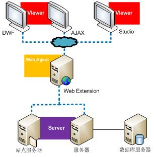
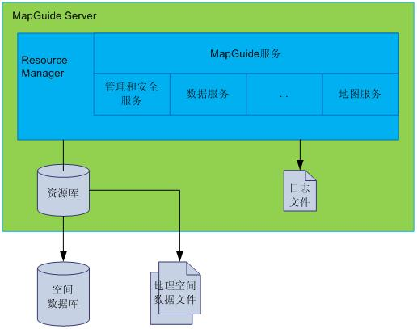
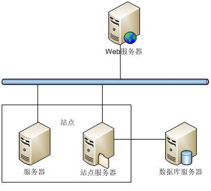
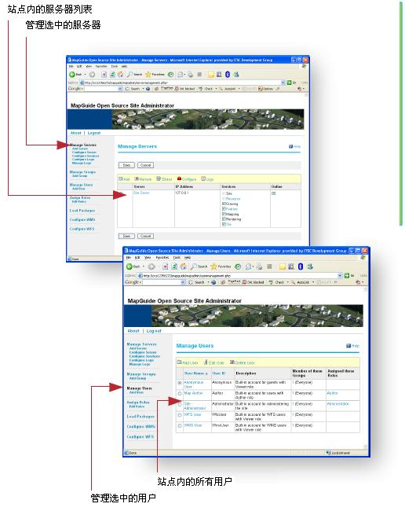
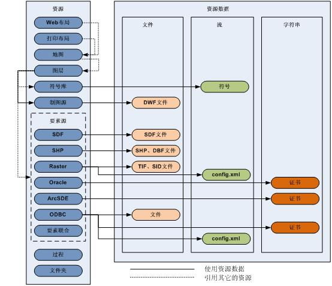
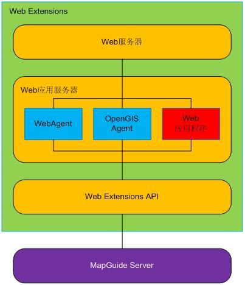
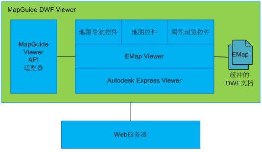

from https://blog.csdn.net/MapGuide_Inside/article/details/4299471

 MapGuide由四个独立的组件(Component)构成，它们分别是：

- MapGuide Server
- MapGuide Web Extensions
- MapGuide Studio
- MapGuide Viewer

  MapGuide Studio和MapGuide Viewer是MapGuide Server的客户端，来自客户端请求使用HTTP协议发送到Web Extentions，Web Extensions的WebAgent组件对这些请求进行处理最后发送到MapGuide Server。当MapGuide Server接收到一个请求，它会访问存储在资源库中资源，以图像或DWF格式创建和渲染地图，最后将地图返回到MapGuide Viewer。MapGuide View用于在屏幕上显示地图、管理图层和要素的属性数据。对于DWF Viewer，返回DWF格式的地图；对于AJAX Viewer，返回图像格式的地图。MapGuide Studio包含了一个内建的DWF Viewer。

 

**1. MapGuide Server**
  MapGuide Server用来管理连接(Connection)、线程池(Thread Pools)、日志，提供各种类型的服务(Service)，响应客户端的服务请求。
  运行于Web应用程序服务器上的程序通过MapGuide Service API访问MapGuide Server提供的服务。MapGuide Service API使用了MapGuide服务TCP/IP协议与MapGuide进行通讯。MapGuide服务TCP/IP协议是一个简单的二进制传输协议，它会将连接和操作请求进行编码发送到MapGuide服务器，并且将MapGuide服务器的响应结果进行解码返回给调用者。
  MapGuide Service API对于MapGuide二次开发人员来说是透明的，如果你不打算研究MapGuide的源代码，那么无需了解MapGuide Service API。

 

**1.1 站点(Site)和服务器(Server)**
  为了解决负载平衡的问题，MapGuide引入了站点(Site)的概念，站点是用来处理MapGuide的服务请求的一系列服务器的集合。用户可以将MapGuide的服务部署到站点内的多个服务器上，这些服务器共享一个独立的资源库(Resource Repository)。资源库存储着要素源(Feature Source)、地图(Map)、图层(Layer)等资源。
  在下图中，站点有两台服务器组成，其中一台用来作为站点服务器。站点服务器上部署着资源库，并且连接到站点内的其他服务器和数据库服务器。

   MapGuide Server提供了七种服务：站点服务(Site Service)、资源服务(Resource)、制图服务(Drawing)、要素服务(Feature Service)、地图服务(Drawing Service)、渲染服务(Rendering Service)和分块服务(Tile Service)。如果你使用的是单机服务器，所有的服务都运行在这一台服务器上。站点服务和资源服务只能运行在站点服务器上，因为站点服务器负责数据的访问和管理站点内的所有资源。如果你有两台或更多的服务器，你可以将除站点服务和资源服务外的任意服务部署到其他服务器上。例如，地图服务和渲染服务是最耗时的操作，我们可以将这两种服务部署到一台独立的服务器，从而提高系统的性能。
  在安装Web Extensions时，会同时安装一个站点管理程序(Site Administrator Program)，通过它你可以管理站点和服务器。这是一个Web界面的应用程序，用户可以通过浏览器来使用它。打开浏览器，在地址栏中输入http://servername/mapguide/mapadmin/login.php，你就可以启动这个程序。其中，“servername”代表安装Web Extensions的服务器的IP地址或名称。
  登录站点管理程序，你可以

- 管理站点。例如：增加、删除服务器，将服务器置为离线(Offline)以进行维护。
- 分派服务到不同的服务器。例如：一台服务器可以处理地图服务，另一台处理渲染服务。
- 监测任何服务器的状态。
- 定义用户和组，管理他们的权限。

 

** 1.2 资源库(Resource Repository) ** 
  资源库是一个基于Berkeley DB XML的XML数据库，用于管理层次结构的资源。一个站点内只能有一个资源库，并且必须驻留在站点服务器。
  在MapGuide中，资源是设计来共享和重用的。资源库中包含两种类型的节点：资源文件夹节点和资源文档节点。资源文件夹代表一个可以包含资源文档和其它资源文件夹的容器，资源文档用来存储一个文档。每种类型的资源节点都有一个唯一的ID、名称、路径和相关的访问权限，我们可以通过资源的ID或路径加文件名访问任意一个资源节点。用户对每个资源节点的访问权限是由它的访问权限决定的，子节点总是继承父节点的访问权限，子节点可以通过覆盖父节点访问权限改变对自己的访问权限。
  一个资源可以引用另一个资源。例如：地图、图层、要素源(Feature Source)被存储为三种不同的资源，地图引用了地图内的所有图层，图层引用了要素源。当原始的要素源更新后，图层也会自动更新。一般情况下，一个资源通过ID来引用另一个资源。这样的话，即使资源被移动或重命名，也无需进行任何修改。
  一个资源也可以是独立的，不引用任何其他资源。例如：打印布局(Print Layerout)。资源库支持如下类型的资源：

- Web布局(Web Layerout)
- 打印布局(Print Layerout)
- 地图(Map)
- 图层(Layer)
- 符号库(Symbol Libary)
- 制图源(Drawing Source)
- 要素源(Feature Source)：
- 过程(Procedure)
- 文件夹(Folder)

  每个资源还可以拥有自己的资源数据(Resource Data)，资源数据可以存储为文件、流和字符串。

- 文件用于存储大量的数据。例如：DWF文件。这个文件直接存储于文件系统中，而不是资源库中。
- 流用于快速访问少量的二进制数据。例如：符号(Symbol)。
- 字符串用于少量的文本数据。例如：数据库的证书(用户名和密码)。
   

 

**2. MapGuide Web Extensions**
  MapGuide Web Extensions是一个可以通过Web Extensions API访问的内部组件，它暴露了MapGuide Server提供给客户端的服务。Web Extensions也是一个应用程序开发平台，开发人员可以调用Web Extensions API开发Web应用程序。目前，Web Extensions API支持PHP、ASP和JSP三种语言。
  WebAgent用来处理来自MapGuide Studio或MapGudie Viewer的请求，将其传输给MapGuide Server。WebAgent实现了MapGuide服务HTTP协议，用于将请求转发给服务器。WebAgent处理传入请求的参数，建立与服务器的连接，调用相应服务的API。在得到API的响应后，将API返回的数据以流的方式返回给客户端。
  OpenGIS Agent实现了多个OpenGIS Web地图协议，使用户可以通过标准OpenGIS客户端的访问MapGuide提供的服务。作为Web服务的空间数据服务规范，只要某一个GIS软件支持这些OpenGIS Web地图协议，其他GIS软件就可以通过这些地图协议定义的接口得到所需要的数据。目前，OpenGIS Web Agent完成了如下协议：

- Web地图服务(Web Map Service)：Web地图服务提供了一个简单的HTTP接口，从地理空间数据库中返回图层级的地图影像数据。这个规范定义了三个操作：GetCapabitities返回服务级元数据，它是对服务信息内容和要求参数的一种描述；GetMap返回一个地图影像，其地理空间参考和大小参数是明确定义了的；GetFeatureInfo（可选）返回显示在地图上的某些特殊要素的信息。
- Web要素服务(Web Feature Service)：Web要素服务地图服务提供了一个简单的HTTP接口，从地理空间数据库中返回是要素的GML编码，并提供对要素的增加、修改、删除等事务操作。Web要素服务允许客户端从多个Web要素服务中取得使用地理标记语言（GML）编码的地理空间数据，定义了五个操作：GetCapabilites返回Web要素服务性能描述文档（用XML描述）；DescribeFeatureType返回描述可以提供服务的任何要素结构的XML文档；GetFeature为一个获取要素实例的请求提供服务；Transaction为事务请求提供服务；LockFeature处理在一个事务期间对一个或多个要素类型实例上锁的请求。
- Web覆盖服务(Web Coverage Service)：Web覆盖服务定义了一个简单的接口和一些操作，用于访问地理空间“覆盖”(Coverage)数据。Web覆盖服务由三种操作组成：GetCapabilities，GetCoverage和DescribeCoverageType。GetCapabilities操作返回描述服务和数据集的XML文档。GetCoverage操作是在GetCapabilities确定什么样的查询可以执行、什么样的数据能够获取之后执行的，它使用通用的覆盖格式返回地理位置的值或属性。DescribeCoverageType操作允许客户端请求由具体的WCS服务器提供的任一覆盖层的完全描述。
  注：覆盖是将闭合区域区内的位置关联于一些属性值的要素。“网络覆盖”(Grid Coverages)一般指卫星影像、航拍影像、遥感图像、数字高程数据等数据，每个像素代表或关联于一个属性值。

  从技术实现的角度，可以将Web服务理解为一个应用程序，它向外界暴露出一个能通过Web进行调用的接口，允许被任何平台、任何系统，用任何语言编写的程序调用。这个应用程序可以用现有的各种编程语言实现。Web服务最大的特点是可以实现跨平台、跨语言、跨硬件的互操作。

 

 

**3. MapGuide Viewer
**  MapGuide Viewer提供了一种途径让用户可以在Web浏览器中浏览地图。目前，最新版本的MapGuide有三种风格的View：

- DWF Viewer：这种类型的Viewer只能工作在Windows平台的IE浏览器，需要用户下载和安装一个ActiveX控件以支持显示DWF格式的数据。
- AJAX Viewer: 这是一个零客户端Viewer，用户无需下载或安装任何软件。它能够工作在Windows平台Microsoft Internet Explorer和MacOS或Linux的Firefox上。
- 基于Fusion的AJAX Viewer：这种Viewer极大地提高了AJAX Viewer从功能和界面方面进行定制的能力。

**3.1 DWF Viewer**
  MapGuide DWF Viewer是基于DWF和Autodesk DWF Viewer (ADV)的。DWF (Design Web Formt) 是Autodesk公司开发的、用户共享工程设计数据的、一种开放、安全的文件格式。DWF文件是一个压缩文件，一般非常小，所以非常易于传输和查看。Autodesk DWF Viewer是用于浏览DWF格式文件的一个工具，它只支持标准的包含二维EPlot文档和三维EModel文档的DWF文件。
  非常遗憾的是Autodesk Design Review 2010不再包含MapGuide DWF Viewer所使用的组件， Autodesk不再支持和维护DWF Viewer，所以MapGuide 2010及其后的版本不再支持DWF Viewer。对于那些仍然依赖于DWF Viewer的MapGuide应用程序，可以通过安装Autodesk Design Review 2009继续使用它们。
  MapGuide DWF Viewer的架构如下图所示：

 

 

  Map文档是MapGuide对现有DWF文件格式的一种扩展，定义了地图的名称、坐标系、范围、地图图层列表、地图图层分组和一系列应用程序扩展。一个DWF文件可以包含多个EMap文档。
  EMap View是对现有Autodesk DWF Viewer的扩展，用来支持显示EMap文档。EMap View可以枚举DWF文件中的所有EMap文档、显示当前的EMap文档、枚举EMap文档中的所有图层、改变每个图层的可见性(Visibility)。同样，EMap Viewer可以利用Autodesk DWF Viewer已有的功能缩放、选择地图上的要素。EMap Viewer使用了如下三种用户界面组件：

- 地图导航控件(Map Navigation Control)：用于选择DWF文件中当前显示的EMap，与地图图例(Map Legend)交互、执行预定的查询等。
- 地图控件(Map Control)：用于浏览地图，按照当前比例尺显示或隐藏图层，计算标注的位置等。
- 属性浏览控件(Property Browsers Control)：用户显示关联到地图、图层、要素的属性信息。这个控件是标准Autodesk DWF Viewer的一部分。

  MapGuide Viewer API适配器(Adapter)暴露了MapGuide 6.x API，提供了一种将以前版本的MapGuide应用程序升级到新版本的解决方案。

**3.2 AJAX Viewer**
  DWF Viewer有不错的性能，因为DWF是一种向量格式的文件，在平移和缩放地图的时候无需向服务器重新发送请求。但是，DWF Viewer只能工作在Windows平台，这非常大地限制了MapGuide的应用。在MapGuide 6.5之后，MapGuide引入了AJAX Viewer来解决这个问题，使MapGuide可以工作在Linux平台。
  使用AJAX Viewer时，地图总是被渲染为图像传送到AJAX Viewer。每次平移或缩放地图，AJAX Viewer会向服务器发送请求，要求重新渲染地图，所以性能要比DWF Viewer差一点。

**3.3 基于Fusion的Viewer
**  Fusion框架是一个灵活的、可扩展的模版系统，它可以将应用程序的界面和功能模块分割开来。在最简单的情况下，一个Fusion应用程序模版(Fusion Application Template)由一个HTML页面组成。通过将Javescript脚本库fusion.js加载HTML页面中，在onload事件中初始化Fusion对象，就可以创建一个Fusion应用程序。Fusion使用了一个专有的XML文档来决定在页面中创建哪些功能模块，MapGuide中这个XML文件作为一个ApplicationDefinition资源存储在MapGuide资源库中。
  我们将Fusion应用程序的每个功能片称之为Widgets，一个Widget包含一种独立的功能。通常情况下，Widget是自包容的，不依赖于任何其他的Widget。但实际中，如果没有其他的Widget，有一些Widget是毫无意义的。一个Widget通常包含了一些用户界面，例如按钮或图例(Legend)。Widget的显示位置是由应用程序模版中的HTML id属性来控制的，但并不受限于Fusion框架。Widget是设计的用于显示在HTML页面中的，它会根据容器的大小自动缩放。同时，Widget也设计为可配置的(Configurable)，通过修改ApplicationDefinition可以订制Widget的功能。通过覆盖某些CSS类，也可以改变Widget的外观。
  Fusion框架使用了Jx库来简化支持不同浏览器的问题。Jx是一个独立的Javascript库，最开始是开发用来支持WebStudio的。当定制一个应用程序的外观时，开发人员通常是定制Jx模块，而不是Widget自身。例如：将所有按钮Widget外观效仿Window XP样式，开发人员实际上会提供一个CSS文件覆盖Jx默认的CSS文件。通常来说，Fusion Widget不包含自己的CSS或可视样式(Visual Style)。
  尽管Fusion由Javascript编写而成，但是它有一种机制可以异步地调用服务器脚本。这样可以大大提升MapGuide Web Extensions API的能力，从而提供更多高级的功能。Fusion的架构是设计的可以支持任何服务器端脚本语言，但是现在只实现了对PHP的支持。
  Fusion的引入是为了解决MapGuide原有的AJAX Viewer在功能和界面方面难于定制的问题。MapGuide创建了一系列widget来复制原有AJAX Viewer的功能，并且开发了几个基本的应用程序模版作为开发新的应用程序的基础。

 

**4. MapGuide Studio**
  MapGuide Studio是一个用来制作收集、准备地理空间数据和制作地图的工具。它只能运行在Windows平台，MapGuide开源版提供了一个免费的预览版Studio，这个版本没有经过严格的测试。MapGuide企业版提供了一个经过严格测试的完全版Studio，不过它是需要付费的。当你使用MapGuide Studio的时候，一般会遵循如下的几个步骤：

1. 为地理空间数据在资源库中创建相应的资源。你既可以直接加载文件类型的数据，也可以连接到一个外部的数据库。
2. 创建图层(Layer)。
3. 编辑地图(Map)，将所需的图层加入地图。
4. 将地图嵌入一个Web Layout中。

  在有了一个Web Layout后，你就可以通过添加自己的代码定制Web应用程序的界面和功能。最后一步就是将完成的Web应用程序发布到Internet或Intranet供用户浏览和交互。
  MapGuide Studio接口分为了三个部分：

- 站点管理器(Site Explorer)
- MapGuide Viewer
- 编辑器(Editor)

  当打开MapGuid Studio连接到站点服务器，站点管理器会显示存储在资源库中的所有资源。双击站点管理器中的任何一个资源，对应的编辑器会打开，用户可以修改资源的信息。如果资源是图层或地图，Viewer会打开并显示数据的预览。

